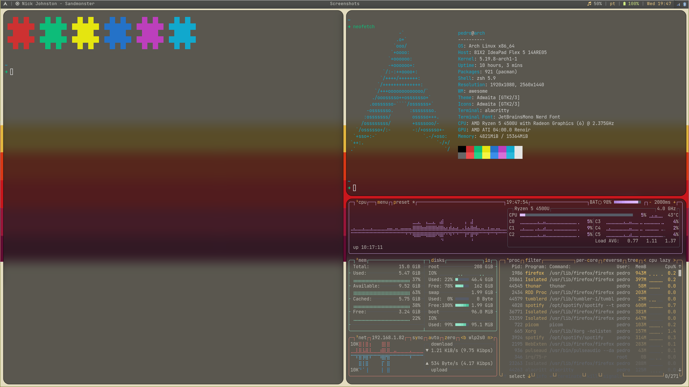

# Linux Config Files/ Installed Packages

## Contains configs for:

- [Alacritty](https://github.com/alacritty/alacritty)
- [AwesomeWM](https://awesomewm.org/)
- [Nvim](https://neovim.io/)
- [Tmux](https://github.com/tmux/tmux/wiki)
- [Picom](https://github.com/jonaburg/picom)
- [Polybar](https://github.com/polybar/polybar) (to properly work, install [Rofi](https://github.com/davatorium/rofi) and [this collection](https://github.com/adi1090x/rofi))
- [Starship](https://starship.rs/)
- [Zsh](https://www.zsh.org/)
- [Xorg](https://www.x.org/wiki/)
- [feh](https://wiki.archlinux.org/title/feh)
- [lf](https://github.com/gokcehan/lf)
- git + [lazygit](https://github.com/jesseduffield/lazygit)

---

## Nix Packages (CLI tools only)

### Requirements

- Git

### Install:

```sh
./install.sh
```

### Compatibility:

Not yet tested.
Should work on most Linux distros and MacOS.

<!-- Tested with: -->

<!-- -  -->

---

## Arch Packages

### Install:

```bash
pacman -S - < requirements.txt
```

### Export:

```bash
pacman -Qqen > requirements.txt
```

## Symlinks

- to create/remove symlinks, cd into `configs/`

### Create:

```bash
stow -t ~/ *
```

### Remove:

```bash
 stow -D -t ~/ *
```

---

## Screenshot


