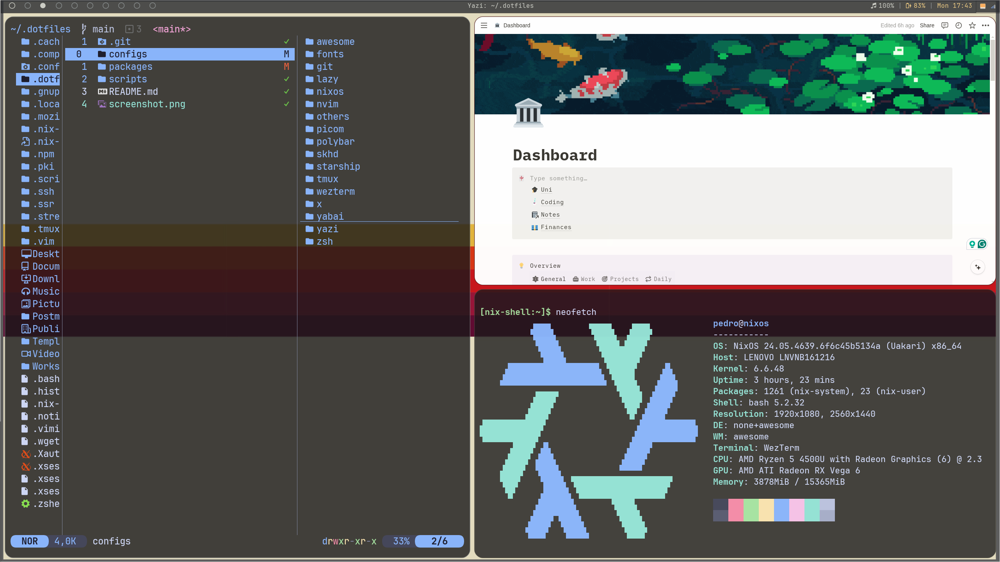
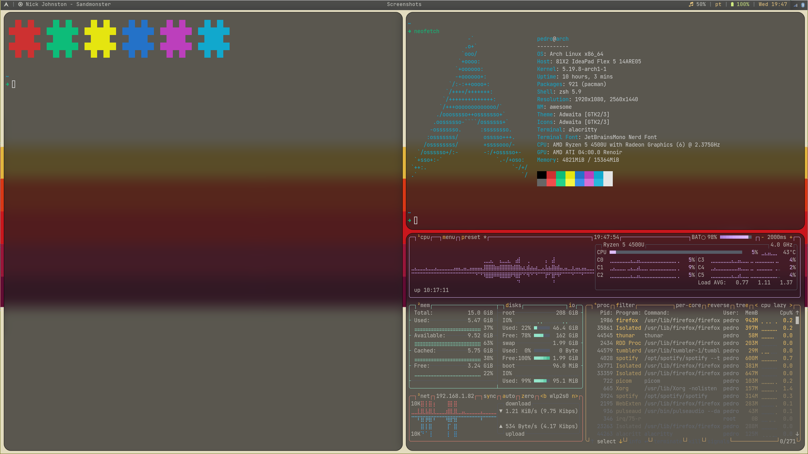

# Linux Config Files/ Installed Packages



## Contains configs for:

- [alacritty](configs/alacritty)
- [awesomeWM](configs/awesome)
- [btop](configs/btop)
- [lazygit & lazydocker](configs/lazy)
- [neovim](configs/nvim)
- [picom](configs/picom)
- [polybar](configs/polybar)
- [skhd](configs/skhd)
- [starship](configs/starship)
- [tmux](configs/tmux)
- [wezterm](configs/wezterm)
- [yabai](configs/yabai)
- [yazi](configs/yazi)
- [zsh](configs/zsh)

---

## NixOS setup

### Requirements

- Git
- [NixOS](https://nixos.org/download.html)

### Install:

```sh
git clone https://github.com/PedroDSFerreira/dotfiles.git ~/.dotfiles && \
    cd ~/.dotfiles && \
    sh scripts/nixos-setup.sh
```

## MacOS setup (not tested)

### Requirements

- Git
- [Nix](https://nixos.org/download.html)
- [Brew](https://brew.sh/)

### Install:

```sh
git clone https://github.com/PedroDSFerreira/dotfiles.git ~/.dotfiles && \
    cd ~/.dotfiles && \
    sh scripts/macos-setup.sh
```

## CLI tools setup

### Requirements

- Git
- [Nix](https://nixos.org/download.html)

### Install:

```sh
git clone https://github.com/PedroDSFerreira/dotfiles.git ~/.dotfiles && \
    cd ~/.dotfiles && \
    sh scripts/cli-setup.sh
```

---

## Symlinks

### Create:

```bash
cd ~/.dotfiles
stow -d configs -t ~/ <config-folder-name>
```

### Remove:

```bash
cd ~/.dotfiles
stow -D -d configs -t ~/ <config-folder-name>
```

---

## Screenshots



